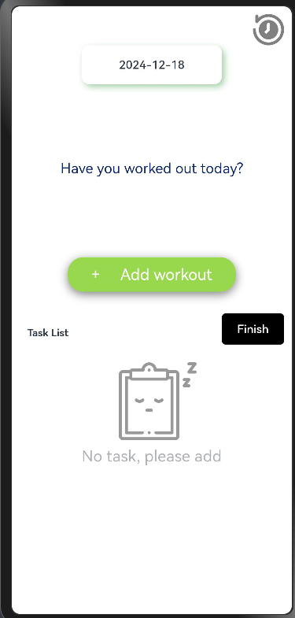
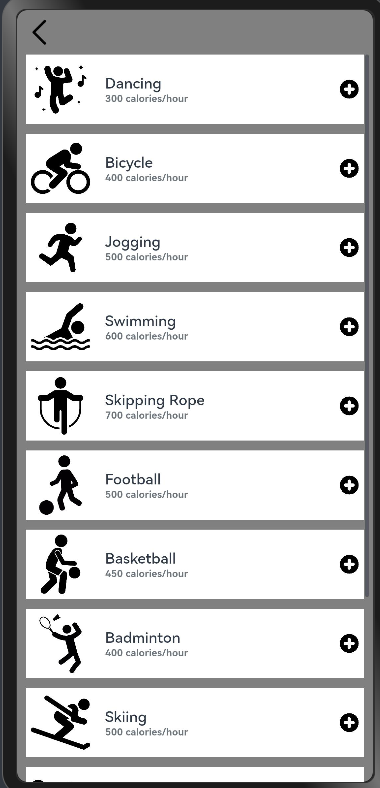
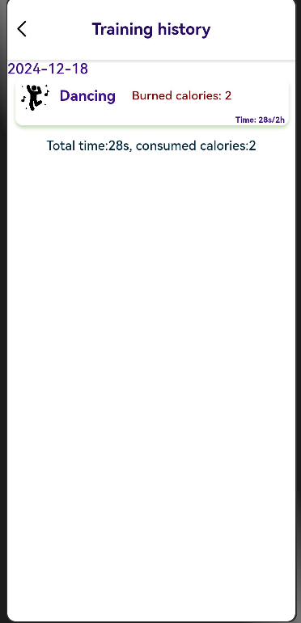
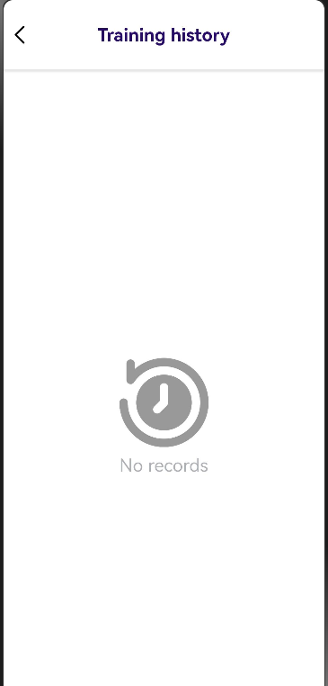

## Workout Logbook application

### Introduction
Workout Logbook app is designed to help users easily record and manage their daily exercise, track exercise duration and calorie consumption, and make health management simple and efficient.

  
  
  
  
  
  
  

Problem faced during development
1. [Implement the use of DatePicker](#implement-the-use-of-datepicker)
2. [Require Panel to choose sport exercise duration](#require-panel-to-choose-sport-exercise-duration)
3. [Pass parameter between customDialog and component](#pass-parameter-between-customdialog-and-component)
4. [Object is undefine in sub component properity](#object-is-undefined-in-sub-component-properity)
## Implement the use of datePicker

#### Background
For the index page of the program we need to add a calender icon, once user click it, it should pop out a dialog for user to select the date for the exercise.

#### Way of implementation
##### Step 1
Construct the frame of the calender page
```typescript
@CustomDialog
struct CalenderDialog {
  controller: CustomDialogController = new CustomDialogController({
    builder: CalenderDialog()
  })
  build() {
    column(){
        Text("Calender information pop up")
    }
  }
}
```

##### Step 2 
Add controller to the index page and link it to the calender icon  

```typescript
  dateSelectionController: CustomDialogController = new CustomDialogController({
    builder: DateDialog({
      date: new Date(this.date)
    })
  })
  calenderDialogController: CustomDialogController = new CustomDialogController({
    builder: CalenderDialog({})
  })
```
## Require Panel to choose sport exercise duration
#### Requirement description
In order to let users easier select the exercise duration, it's good to add a keyboard on the page as follows.


#### Implementation
code as following:
```typescript
  @Builder
  confirmButton(text: string, color: ResourceColor | string, onClick: ((event: ClickEvent) => void)) {
    //required varaible and data
  @State show: boolean = true
  keyboardArray: string[] = ['1', '2', '3', '4', '5', '6', '7', '8', '9', '0', '.']
  controller: CustomDialogController

    // confirm button
    Button() {
      Text(text)
        .fontSize(20)
        .fontWeight(800)
        .opacity(0.9)
    }
    .width(100)
    .height(50)
    .type(ButtonType.Normal)
    .backgroundColor(color)
    .borderRadius(5)
    .padding({ left: 5, right: 5 })
    .margin({top: 15})
  }

// Use Panel in this case
  Panel(this.show) {
  Column() {
    Grid() {
      ForEach(this.keyboardArray, (item: string) => {
        GridItem() {
          Text(item)
            .fontSize(20)
            .fontWeight(500)
        }
        .keyboardButtonStyle()
        .onClick(() => {
          // todo: add keyboard click event
        })
      })

      GridItem() {
        Text('Delete')
          .fontSize(20)
          .fontWeight(500)
      }
      .keyboardButtonStyle()
      .onClick(() => {
        // todo: add delete button click event
      })

      GridItem() {
        this.confirmButton('Confirm', '#ff0ef3eb', () => {
          this.show == false
        })
      }
      .columnStart(0)
      .columnEnd(2)

    }
    .columnsTemplate('1fr 1fr 1fr')
    .columnsGap(4)
    .rowsGap(4)
    .width('95%')
    .padding({ top: 15 })
  }
}
.mode(PanelMode.Half)
.halfHeight(1050)
.type(PanelType.Temporary)
.dragBar(false)
.width('100%')
```

## Object is undefine in sub component properity
#### Problem background
I defined `Sport` class but when read the `burnedCalories` and `UsedTime` attributes gives error `undefined`
```typescript
export class Sport {
  name: string = ''
  icon?: Resource = $r('app.media.app_icon')
  consume: number = 0
  num?: number | string = 0
  target?: number | string = 0
  unit: string = ''
  isFinish?: boolean = false
  isStart?: boolean = false
  burnedCalories?: number = 0
  usedTime?: number = 0
}
```

#### Solution
We need to provide not only an initial value for that attribute but also not use `?` mark for the parameter we are for sure to render.

## Pass parameter between customDialog and component
#### Parameter from base component to customDialog
In our case for example if click the `add` button in sport page pop up a customDialog and we want to see which sport we are looking at, it is necessary to pass these parameters from base component page to customDialog.

For me, I stored the `current_sport` in global app scope, and in customDialog access it.

```typescript
// In component's Button
Button('Add')
  .onClick(() => {
    this.current_sport = item
    this.current_sport.num = this.num
    AppStorage.setOrCreate("current_sport", this.current_sport);
    this.controller.open()
  })

// In customDialog
  export struct SportDetailDialog {
  @State current_sport: Sport = AppStorage.get("current_sport") ?? new Sport()
  controller: CustomDialogController

    build(){
      //Then we can access the parameter passed from base component
    }
  }
```

#### Parameter from customDialog to base component
In our case we also select some practice hours in the customDialog and want access that data externally, then we have to pass such parameter from customDialog to base component.

The solution is to use `@Link` decorator
```typescript
export struct SportDetailDialog {
      @Link hours: number;

  build(){
    // ...    
  }
}

struct AddSport {
  @StorageLink("current_sport") current_sport: Sport = new Sport();
  @State num: number = 0
  controller: CustomDialogController = new CustomDialogController({
    builder: SportDetailDialog({
      num: $num
    })
  })
  build(){
    // ...    
  }
}
```
We need to define a same named `state variable` in base component, define a `@Link` decorated variable in customDialog, and linking them in base component's controller builder using `$` sign.

Then, all the parameter we found in customDialog will be rendered in our base component.


